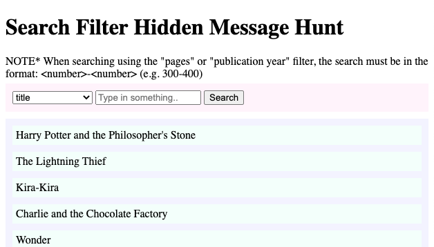

# Search Filter Hidden Message Hunt

A fun activity for beginner coders to learn about JavaScript objects, arrays, and functions. The goal is to decode a hidden message by building a search filter that can search through a big list of Book objects and to display the search results dynamically using HTML and JavaScript.

The problem files and list of questions can be found in the `problem` folder. The solution code and hidden message are in the `solution` folder.

<!--  -->

#### Learning Goals
* how to access object properties in JavaScript
* how to iterate over arrays
* how to interact with HTML elements using JavaScript
